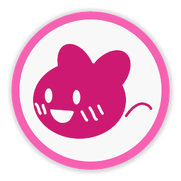

# YukkuLips

### これは何？

キャラ素材を用いた動画作成を支援するmacOS用アプリケーションです。キャラ素材については[こちら](https://dic.nicovideo.jp/a/%E3%82%AD%E3%83%A3%E3%83%A9%E7%B4%A0%E6%9D%90%E3%82%B9%E3%82%AF%E3%83%AA%E3%83%97%E3%83%88)をご覧ください。また、キャラ素材を入手するには本家の[nicotalk&キャラ素材配布所](http://www.nicotalk.com/charasozai.html)等の配布サイトをお訪ねください。

このアプリケーションには以下の機能があります：

- タイトル画面や立ち絵等に利用するために、**キャラ素材を静画出力する機能**
- 音声合成アプリケーションによる音声に合わせて**キャラ素材をリップシンク**させた、**クロマキー合成用の動画を出力する機能**

### 諸注意

キャラ素材は本来、Windows用動画制作ソフトである**AviUtl**と、AviUtl用のスクリプトである**キャラ素材スクリプト**による使用を想定して開発されています。YukkuLipsは、そのキャラ素材をmacOS上でiMovie等のアプリケーションによる動画制作に使用できるように、簡易的な機能のみを実装したアプリケーションとなります。キャラ素材の読み込み自体は**キャラ素材スクリプトVer4a**相当を念頭に置いていますが、**キャラ素材スクリプト非対応であること、機能が非常に限定的であることにご注意ください**。

また、**キャラ素材を用いて作成したコンテンツの発表**に当たっては、オリジナルのキャラ素材スクリプトを開発された**ズーズ様や各キャラ素材作者様が定められた規約**に従う必要があります。詳しくは[利用上の注意](#利用上の注意)をご覧ください。

### 動作環境

macOS Catalina で開発・動作確認しています。

## 導入方法

### ダウンロード

[https://github.com/PickledChair/YukkuLips/releases](https://github.com/PickledChair/YukkuLips/releases)から"YukkuLips-darwin-x64.zip"をダウンロードしてください。

### インストール

zipファイルを解凍したフォルダ内にある"YukkuLips.app"を任意のフォルダに移してください（通常はアプリケーションフォルダ）。

Macのセキュリティ設定により、ブラウザでダウンロードしたアプリケーションは初回は左クリックで起動できないので、右クリックメニューから「開く」を選択して起動してください。

## 利用上の注意

### 各素材・ツールの規約確認

キャラ素材を使用したコンテンツを発表するに当たっては、キャラ素材スクリプト利用規約と素材ごとの規約のそれぞれに従ってください。キャラ素材スクリプトを使用した動画制作は**非商用動画に限る**など、重要なルールがあります。詳細についてはズーズ様による[キャラ素材の規約](http://www.nicotalk.com/kiyaku.html)をご参照ください。

また、動画制作の場合、音声合成ソフトや動画制作ツール等の使用においても、各規約に従ってください。

### アプリケーションのフリーズ・異常終了

アプリケーションがフリーズした場合は、強制終了を行ってください。フリーズ・異常終了その他の不具合報告については[不具合報告・質問・連絡先](#不具合報告・質問・連絡先)をご参照ください。

## リリースノート

[https://github.com/PickledChair/YukkuLips/releases](https://github.com/PickledChair/YukkuLips/releases)に順次追加されます。

## ライセンス

このプロジェクトは[MIT License](https://github.com/PickledChair/YukkuLips/blob/master/LICENSE.txt)で公開しています。

## 謝辞

このアプリケーションはキャラ素材をmacOS上で扱うことを目的としていることから、**キャラ素材の存在なしには成立しないソフトウェアです**。キャラ素材およびキャラ素材スクリプトの開発にご尽力された、次のお二方のお名前を特に挙げさせていただき、感謝申し上げたいと思います。

- **ズーズ様**（キャラ素材スクリプトの開発、および「yukktalk」,「nicotalk」の開発。[nicotalk&キャラ素材配布所](http://www.nicotalk.com/charasozai.html)を参照）
- **きつね様**（キャラ素材の仕様に関する開発協力、およびキャラ素材の提供。[きつねゆっくりのお部屋](http://www.nicotalk.com/ktykroom.html)を参照）

キャラ素材の作者様は数多く、ここで名前を全て挙げることはできませんが、キャラ素材に関わる全ての方々に感謝申し上げます。

また、YukkuLipsは基本的にゆっくり動画（ゆっくり解説、ゆっくり実況）の制作に用いられることを想定しています。したがって、macOS上で**ゆっくりの音声を出力できるアプリケーションの存在も欠かせません**。

- **でんすけ様**（「[ゆっくろいど](http://www.yukkuroid.com/)」や「[ゆくも!](http://www.yukumo.net/)」の開発）
- **taku-o様** （ゆっくろいどの代替ソフト「[MYukkuriVoice](https://github.com/taku-o/myukkurivoice)」の開発）

以上のお二方にも、この場を借りて御礼申し上げます。

## 不具合報告・質問・連絡先

アプリケーションの不具合報告は[このリポジトリのIssue](https://github.com/PickledChair/YukkuLips/issues)にお願いします。

また、その他使用方法などのご質問は[ツイッターアカウント](https://twitter.com/pickled_chair)へのDMかメールアドレス ubatamamoon [at] gmail [dot] com へよろしくお願いします。ご要望に関しては、対応が遅れるか未対応とさせていただく可能性があることをご理解ください。
